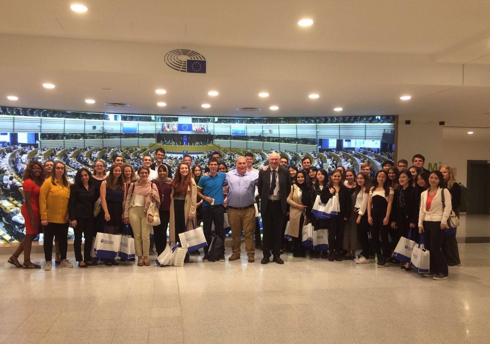

 <!--

-->  <!--

-->At the European Parliament with Essex students<!--
--> <!--
-->

### University of Essex
Institutions of Democracy (SP 2016/17–2017/18)

The European Union (SP 2016/17–2017/18)

German Politics (SP & AU 2016/17-2017/18)

Comparative European Politics (SP & AU 2016/17-2017/18)

### Johannes Gutenberg University of Mainz
Data analysis using SPSS (SU & WI 2011-2012)
	
### Free University of Berlin
Tutorial: Introduction to Political Science (WI 2007/08)

Tutorial: Modern Political Theory (WI 2007/08)
